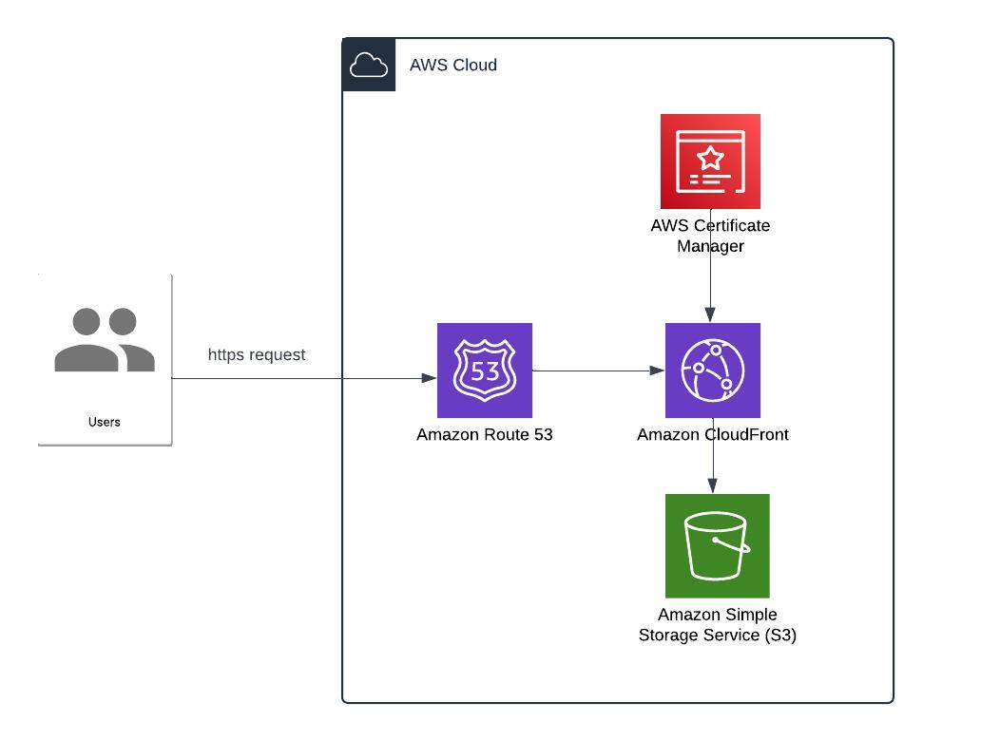

# Hosting a static website on AWS using Terraform



This Terraform project sets up the following AWS infrastructure:

- **S3 Bucket**: For storing static assets.
- **CloudFront Distribution**: For serving content from the S3 bucket.
- **Route 53**: For managing DNS records and routing domain traffic.
- **AWS Certificate Manager (ACM)**: For provisioning and managing SSL/TLS certificates.

## Requirements

- Terraform 1.0.0 or later
- AWS CLI configured with appropriate IAM credentials
- An existing AWS account with permissions to create the required resources

## Project Structure

- `main.tf`: Contains the main Terraform configuration for setting up S3, CloudFront, Route 53, and ACM.
- `variables.tf`: Defines the variables used in the configuration.
- `provider.tf`: Configures the AWS providers.
- `terraform.tfvars`: Contains variable values for the configuration.

## Getting Started

### 1. Clone the Repository

```bash
git clone https://github.com/pp0lina/terraformStaticWebsite.git
```

### 2. Configure AWS Credentials

Ensure that your AWS credentials are configured either through the AWS CLI or environment variables.
```bash
aws configure
```

### 3. Initialize Terraform

Update terraform.tfvars with the appropriate values for your environment and initialize the Terraform working directory.

```bash
terraform init
```

### 4. Review the Configuration

Review the Terraform plan to see what changes will be made:

```bash
terraform plan
```

### 5. Apply the Configuration

Apply the Terraform configuration to create the resources:

```bash
terraform apply
```

### 6. Verify Resources

After applying, verify that the resources have been created.


Clean Up
--------

To remove the resources created by this configuration, run:

```bash
terraform destroy
```

Notes
-----

-   Ensure you have appropriate IAM permissions to create and manage S3, CloudFront, Route 53, and ACM resources.
-   This project assumes that you have a domain registered and managed via Route 53.


Contributing
------

If you spot something that could be improved or have any ideas to make this project better, feel free to contribute!
